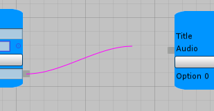

# Dialog Node Editor
Basic usage of the extension

Example: Assets/DialogNodeEditor/Example

## Canvas
### Entry

### Nodes
Right click canvas to create nodes. Right click node to delete node

Start Node
* Starting point for the dialog

End Node
* Purely for aesthetic
* Shows where/when a dialog ends

Dialog Node
* Creates dialog point
* Options determine which node to go to next

### Connections
Creates links between nodes. Nodes cannot be connected to itself and output cannot have multiple connections (inputs may have multiple connections)

Click on input or output point to start a connections. Connections will be magenta and will turn white once connected to another point. Click white box to delete connection

### Save/Load/Build
Save
* Creates EditorSaveObject as an asset file
* Used to rebuild canvas for later editing
* EditorSaveObject not used for production, only as a tool

Load
* Loads EditorSaveObject asset file

Build
* Creates BuildObject asset file
* BuildObject is used for production
* Cannot Load BuildObjects

## BuildObject
BuildObject is used to traverse the dialog. Dialog is traversed only one way.
### Get()
Returns Clone of the BuildObject class. Used if you do not want to edit the asset file.
### Next(string option)
Iterates to the next dialog node
### GetCurrent()
Returns BuildNode class of the current dialog node
### Reset()
Resets class back to the entry dialog node

## BuildNode
Representation of the dialog node
### title
Returns title of the node
### clip
Returns AudioClip of the node
